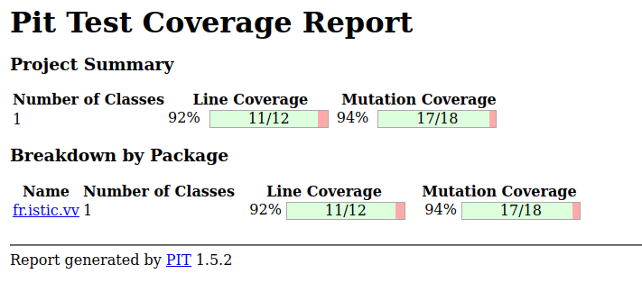

# Balanced strings

A string containing grouping symbols `{}[]()` is said to be balanced if every open symbol `{[(` has a matching closed symbol `]}` and the substrings before, after and between each pair of symbols is also balanced. The empty string is considered as balanced.

For example: `{[][]}({})` is balanced, while `][`, `([)]`, `{`, `{(}{}` are not.

Implement the following method:

```java
public static boolean isBalanced(String str) {
    ...
}
```

`isBalanced` returns `true` if `str` is balanced according to the rules explained above. Otherwise, it returns `false`.

Use the coverage criteria studied in classes as follows:

1. Use input space partitioning to design an initial set of inputs. Explain below the characteristics and partition blocks you identified.
2. Evaluate the statement coverage of the test cases designed in the previous step. If needed, add new test cases to increase the coverage. Describe below what you did in this step.
3. If you have in your code any predicate that uses more than two boolean operators check if the test cases written so far satisfy *Base Choice Coverage*. If needed add new test cases. Describe below how you evaluated the logic coverage and the new test cases you added.
4. Use PIT to evaluate the test suite you have so far. Describe below the mutation score and the live mutants. Add new test cases or refactor the existing ones to achieve a high mutation score.

Write below the actions you took on each step and the results you obtained.
Use the project in [tp3-balanced-strings](../code/tp3-balanced-strings) to complete this exercise.

## Answer

Pour couvrir un maximum de cas, nous avons testé la fonction sur des chaînes de caractères quelconques de tailles variables. Il faut aussi tester les edges cases comme une chaine de caractère vide ou une chaine de caractère contenant un seul symbole ouvrant ou fermant. La fonction est aussi testée avec une chaine de caractère contenant que des symboles ouvrant ou que des symboles fermant.


|              Test               | Explication                                                |
|:-------------------------------:|------------------------------------------------------------|
|               ""                | une chaine de caractère vide est balanced                  |
|             “([])”              | une chaîne de caractère simple qui est balanced            |
|          “{hello    }”          | une chaîne de caractère quelconque balanced.               |
|               “[“               | edge case avec seulement un crochet ouvrant.               |
|               “]”               | edge case avec seulement un crochet fermant.               |
|              “[{(“              | que des ouvertures.                                        |
|              “])}”              | que des fermetures.                                        |
|          “(( [] ] ))”           | un caractère ‘]’ en trop.                                  |
| “hello [[[{ hello } () ]] () ]” | une chaîne de caractère quelconque un peu plus compliquée. |

4. Avec ces tests, on obtient un score de 94% de mutants tués (17 sur 18) :
    
    Le mutant qui n'a pas été tué est un mutant est un mutant de type `True returns Mutator (TRUE_RETURNS)`.
    Ce mutant remplace une expression booléenne par true.